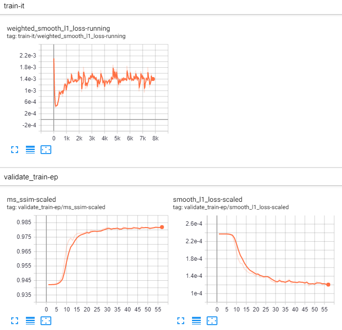
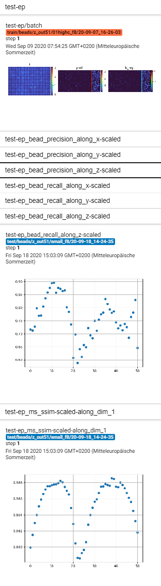

# HyLFM-Net

## Requirements
- [CUDA-enabled GPU](https://developer.nvidia.com/cuda-gpus#compute)
- Linux OS (tested on CentOs Linux 7 (Core))
- [[mini]conda](https://docs.conda.io/en/latest/miniconda.html#linux-installers) (tested with miniconda 4.8.4)

## Installation
##### Clone repository
Clone and navigate to this repository
```
git clone git@github.com:kreshuklab/hylfm-net.git
cd hylfm-net
```

##### Install hylfm conda environment
```
conda env create -f environment.yml
```
##### Install time
The install time greatly depends on download speed (several hundred MB).
Without download (or very fast download), the [installation](#install-hylfm-conda-environment) takes around nine minutes.

## Demo
##### Activate hylfm conda environment
```
conda activate hylfm
```

##### Choose a CUDA device
When running hylfm ([train](#train-hylfm-net-on-beads) or [test](#test-hylfm-net-on-beads)) a CUDA device will be used. Run `nvidia-smi` to see available CUDA devices on your machine. If more than one CUDA device is available you need to specify which one to use either bei setting the 'CUDA_VISIBLE_DEVICES' environment variable or by command line argument: `python -m hylfm --cuda <cuda device, e.g. 0> ...`.

##### Train HyLFM-Net on beads
```
python -m hylfm configs/train/beads/z_out51/small_f8.yml
```

##### Test HyLFM-Net on beads
Download (to hylfm-net/download).
```
python -m hylfm configs/test/beads/z_out51/small_f8.yml --checkpoint small_beads_demo
```

##### Monitoring with tensorbaord
With default settings and in the [hylfm repository directory](#clone-repository), run
```
$ tensorboard --logdir=logs
TensorBoard 1.15.0 at <address>:<port> (Press CTRL+C to quit)
```
With the tensorboard running, open `<address>:<port>` in your browser to see logged scalars:<br>


Switch to `<address>:<port>/#images` for 2d (and max projections of 3d) tensors and plots:<br>


## On Your Data
- Write a `get_tensor_info` function in `hylfm/datasets/local/<your dataset group>.py` analogously to `hylfm/datasets/local/example.py`.
- Write a config yaml file in `configs` analogously to `configs/train/beads/z_out51/small_f8.yml`.
    - Use tensors from \<your dataset group\>:
   
        in demo `small_f8.yml`: <br>
        `- tensors: lf: beads.small_0, ls_reg: beads.small_0}`
        
        in your `configs/**/<your config>.yml`: <br>
        `- tensors: {<name>: local.<your dataset group>.<tag>, <other name>: local.<your dataset group>.<tag>}`

- Train or test HyLFM-Net as described in [Demo](#demo).

## Settings (advanced)
To overwrite default settings, adapt `hylfm/_settings/local.py` (copy from `hylfm/_settings/local.template.py`)
